# Nano 33 BLE SensorLab — 센서 실험실 (USB · WebUI · phyphox)

> Arduino Nano 33 BLE Sense의 **내장 센서**를 USB Serial·Web Bluetooth **브라우저 대시보드 또는 스마트폰 phyphox 앱에** 실시간 표시·기록·내보내기 하는 프로젝트. 학생이 상황에 따라 **USB Serial / BLE WebUI / phyphox(모바일)를 골라** 쓸 수 있다. 고등학교 SW·AI·물리 실습용.

🔗 **프로젝트개요:** https://xparapx.github.io/Arduino_Nano33_BLE_SensorLab/  
🖥️ **WebUI:** https://xparapx.github.io/Arduino_Nano33_BLE_SensorLab/dashboard.html  
📘 **매뉴얼:** https://xparapx.github.io/Arduino_Nano33_BLE_SensorLab/manual.html  
📱 **phyphox 연동:** https://xparapx.github.io/Arduino_Nano33_BLE_SensorLab/phyphox.html

`Nano 33 BLE Sense` · `nRF52840` · `Web Serial` · `Web Bluetooth` · `phyphox` · `Chart.js` · `CSV·XLSX`

---

## 01. 프로젝트 요약

> "센서값이 어떻게 화면까지 오는가"를 **보드 → 통신 → 브라우저**로 직접 따라가 보는 프로젝트입니다.

Nano 33 BLE Sense가 내장 센서(가속도·온습도·기압·광/제스처 등)를 읽어, **USB Serial** 또는 **BLE**로 전송한다. 브라우저 단일 HTML 대시보드가 이를 수신·파싱해 **Chart.js로 실시간 그래프**를 그리고, 수집 데이터를 **CSV/XLSX로 내보낸다**. 무선이 필요 없으면 USB로 확실하게, 무선 실습이 필요하면 BLE로 — 한 대시보드에서 모드만 바꾸면 된다.

## 02. 프로세스 흐름도

```
 ① 센서 측정       ② 펌웨어 전송          ③ 브라우저 수신        ④ 시각화·기록       ⑤ 내보내기
  내장 센서 읽기     USB Serial / BLE       파싱(processLine /     Chart.js 실시간     CSV · XLSX
                   (sendData)             onBLELine)            그래프 + 수집        파일 저장
 [Nano 33 BLE] ─USB/BLE→ [브라우저 대시보드] ─pushData→ [차트] ─export→ [파일]
```

## 03. 준비물

### 하드웨어 (실물)
| 항목 | 비고 |
|---|---|
| Arduino Nano 33 BLE Sense | Rev1 또는 Rev2 (센서 내장) |
| USB 케이블 | 전원 + Serial 통신 |
| (선택) LiPo 3.7V 배터리 | BLE 무선 동작 시 |
| PC | Chrome 또는 Edge (Web Serial·Web Bluetooth 필요) |

### 소프트웨어 · 라이브러리
| 도구 | 비고 |
|---|---|
| Arduino IDE | 2.x · 보드: Arduino Mbed OS Nano Boards |
| ArduinoBLE | BLE 모드용 |
| 센서 라이브러리 | Rev1: HTS221·LSM9DS1 / Rev2: HS300x·BMI270_BMM150 등 |
| Chrome / Edge | Web Serial·Web Bluetooth — Safari·Firefox 불가 |

## 04. 기술 스택

- **센서** — Nano 33 BLE Sense 내장 IMU·온습도·기압·광/제스처
- **MCU** — nRF52840 (BLE 전용, Wi-Fi 없음), FICR DEVICEID로 보드 고유 식별
- **통신** — USB Serial(Web Serial API) / BLE GATT(Web Bluetooth API)
- **UI** — 단일 HTML, Chart.js 실시간 차트, CSV·XLSX 내보내기, 다크/라이트 테마

## 05. 저장소 구조

```
Arduino_Nano33_BLE_SensorLab/
├─ firmware/                          # 보드 펌웨어 (.ino)
│  ├─ nano33ble_dashboard_rev1.ino    # Rev1 (HTS221·LSM9DS1)
│  ├─ nano33ble_dashboard_rev2.ino    # Rev2 (HS300x·BMI270)
│  └─ nano33ble_phyphox_rev2.ino      # phyphox 전용 (WebUI 펌웨어와 택일)
├─ docs/                              # GitHub Pages (/docs)
│  ├─ index.html                      # 프로젝트 개요 (README 구조 동일)
│  ├─ manual.html                     # 운용 매뉴얼 — 설치·연결·진단
│  ├─ dashboard.html                  # 배포용 — 라이브러리 내장(오프라인 동작), 개요에서 링크
│  ├─ dashboard_cdn_dev.html          # 개발용 — Chart.js·xlsx를 CDN 로드(인터넷 필요)
│  ├─ phyphox.html                    # phyphox 연동 안내 — 설치 절차·QR 갤러리
│  └─ phyphox/                        # 실험 .phyphox 11종 + zip + QR PNG
│     └─ qr/                          # QR 코드 이미지 12개 (tools/generate_qr.py 생성)
├─ tools/                             # 개발 도구 (Pages 미배포)
│  ├─ generate_experiments.py         # 실험 XML 재생성기
│  └─ generate_qr.py                  # QR PNG 생성기
├─ README.md
└─ .gitignore
```

> **Pages 설정** — 개요·대시보드가 모두 `docs/`에 있으므로 소스를 **`/docs`** 로 둡니다(다른 프로젝트와 동일). Web Bluetooth는 `file://`에서 동작하지 않으므로 https 발행이 필수입니다. 개요 페이지의 "대시보드 열기" 버튼은 같은 폴더의 `dashboard.html`로 연결됩니다.
>
> **두 대시보드 파일** — `dashboard.html`은 Chart.js·SheetJS를 **파일에 내장**해 인터넷 없는 교실에서도 동작하는 **배포용**입니다. `dashboard_cdn_dev.html`은 같은 라이브러리를 **CDN에서 로드**하는 가벼운 **개발용**으로, 평소 수정은 개발용에서 하고 완성되면 배포용 단일 파일을 갱신합니다.

---

## 실행 방법

1. **펌웨어 업로드** — 보드 리비전에 맞는 `firmware/nano33ble_dashboard_revN.ino`를 Arduino IDE에서 업로드.
2. **대시보드 열기** — 개요 페이지(`.../Arduino_Nano33_BLE_SensorLab/`)의 "대시보드 열기" 버튼, 또는 직접 `.../dashboard.html` 접속. (로컬 `file://`로 열면 BLE가 막히니 Pages 주소를 사용.)
3. **연결**
   - **USB**: `USB 연결` → 포트 선택. 부팅 메시지에서 DEVICE ID를 자동 추출해 BLE 연결창에 미리 채워줌.
   - **BLE**: `BLE 연결` → 장치 선택(`BLE-XXXX`). 무선 동작 시 보드를 PC 30cm 이내, 배터리 3.3V 이상 유지.
4. 센서 토글·샘플링 주기 설정 후 수집 시작 → 종료 시 CSV/XLSX로 내보내기.

## phyphox 모바일 연동

PC 없이 **스마트폰만으로** 센서 데이터를 수집·시각화·내보내기 하는 모드. 펌웨어는 `firmware/nano33ble_phyphox_rev2.ino`를 업로드한다 (**WebUI 펌웨어와 택일** — 모드를 바꿀 때마다 해당 펌웨어를 다시 업로드).

설치 3단계: [phyphox 앱](https://phyphox.org/download/) 설치 → 앱 내 **＋ → QR 스캔** → 재생(▶).

**전체 11종 일괄 설치** — 아래 QR 하나로 모든 실험이 설치된다 (기본 배포 수단):

| 전체 일괄 설치 | QR | 링크 |
|---|---|---|
| 실험 11종 (zip) | 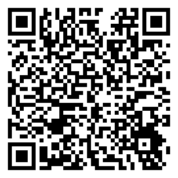 | [nano33_experiments.zip](https://xparapx.github.io/Arduino_Nano33_BLE_SensorLab/phyphox/nano33_experiments.zip) |

설치 세부 절차·문제 해결은 [phyphox 연동 안내](https://xparapx.github.io/Arduino_Nano33_BLE_SensorLab/phyphox.html) 참조.

<details>
<summary>센서종류별 QR</summary>

| 실험 | QR | 링크 |
|---|---|---|
| 가속도 | 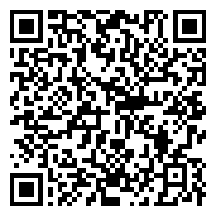 | [01_acceleration.phyphox](https://xparapx.github.io/Arduino_Nano33_BLE_SensorLab/phyphox/01_acceleration.phyphox) |
| 자이로스코프 | 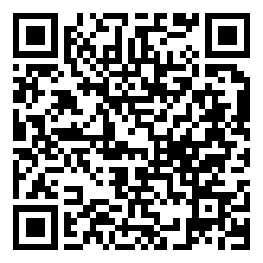 | [02_gyroscope.phyphox](https://xparapx.github.io/Arduino_Nano33_BLE_SensorLab/phyphox/02_gyroscope.phyphox) |
| 자기장 | 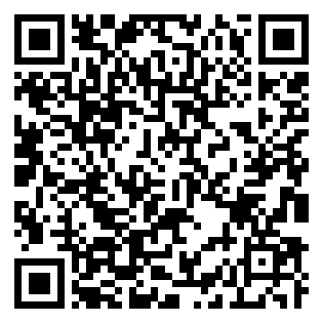 | [03_magnetometer.phyphox](https://xparapx.github.io/Arduino_Nano33_BLE_SensorLab/phyphox/03_magnetometer.phyphox) |
| 온도·습도 | 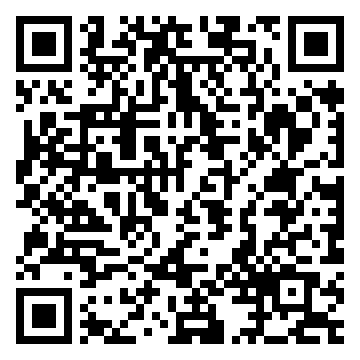 | [04_temp_humidity.phyphox](https://xparapx.github.io/Arduino_Nano33_BLE_SensorLab/phyphox/04_temp_humidity.phyphox) |
| 기압·온도 | 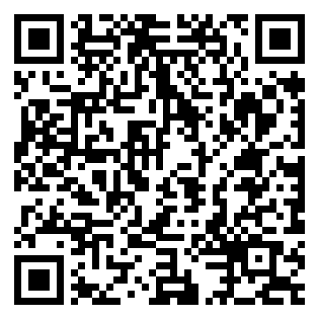 | [05_pressure_temp.phyphox](https://xparapx.github.io/Arduino_Nano33_BLE_SensorLab/phyphox/05_pressure_temp.phyphox) |
| 색상 (RGB) | 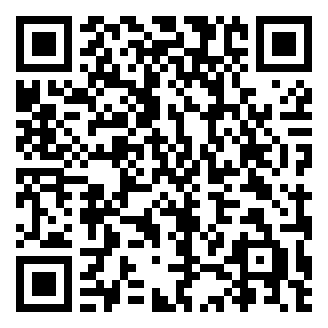 | [06_color.phyphox](https://xparapx.github.io/Arduino_Nano33_BLE_SensorLab/phyphox/06_color.phyphox) |
| 조도 | 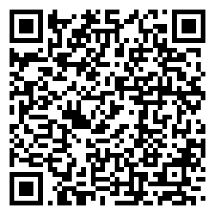 | [07_illuminance.phyphox](https://xparapx.github.io/Arduino_Nano33_BLE_SensorLab/phyphox/07_illuminance.phyphox) |
| 제스처 | 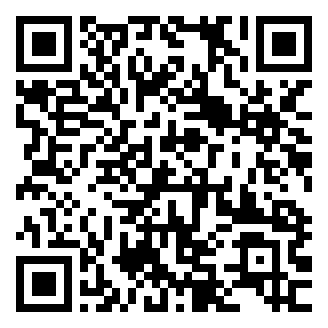 | [08_gesture.phyphox](https://xparapx.github.io/Arduino_Nano33_BLE_SensorLab/phyphox/08_gesture.phyphox) |
| 근접 | 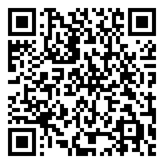 | [09_proximity.phyphox](https://xparapx.github.io/Arduino_Nano33_BLE_SensorLab/phyphox/09_proximity.phyphox) |
| 음량 | 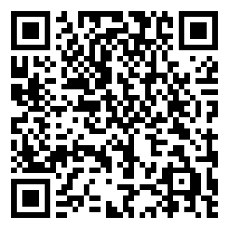 | [10_sound.phyphox](https://xparapx.github.io/Arduino_Nano33_BLE_SensorLab/phyphox/10_sound.phyphox) |
| 외장 센서 (아날로그) | 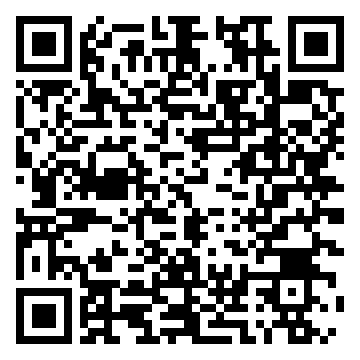 | [11_analog_external.phyphox](https://xparapx.github.io/Arduino_Nano33_BLE_SensorLab/phyphox/11_analog_external.phyphox) |

</details>

## 핵심 사양

**BLE** — Characteristic 3개로 통합(초기 9개에서 축소), TX power +8dBm, Connection Interval 50~100ms, 500ms Keep-alive heartbeat. 자동 재연결(지수 백오프, 최대 5회).

**보드 식별** — nRF52840 **FICR DEVICEID**(공장 고유값) 기반. USB 부팅 메시지의 `# DEVICE ID : XXXX` / `# ID: XXXX / BLE-XXXX`를 대시보드가 파싱해 localStorage에 저장 → 학생이 시리얼 모니터를 열 필요 없음.

**데이터 흐름** — `sendData()` → USB/BLE → `processLine()`/`onBLELine()` → `pushData()` → Chart.js 갱신.

## 빠른 진단 (요약)

| 증상 | 원인 / 해결 |
|---|---|
| BLE 장치가 안 보임 | `file://`로 열었거나 Pages 미호스팅 → https 주소로 접속 |
| BLE 스캔 자체가 안 됨 | AirPods 등 BLE 기기 간섭 → 페어링 해제 후 재시도 (`chrome://bluetooth-internals`로 진단) |
| 온습도값이 0 | I2C 타이밍 충돌 → `IMU.begin()`과 `HTS.begin()` 사이 delay + 재시도 |
| 연결됐는데 차트 정지 | 차트 갱신이 수집 상태가 아닌 **연결 상태**에 묶여야 함 |
| 무선 중 간헐 끊김 | 거리 단축(30cm), 배터리 3.3V 이상, BLE.poll() 호출 확인 |

상세 진단·운용 절차는 [매뉴얼](https://xparapx.github.io/Arduino_Nano33_BLE_SensorLab/manual.html) 참조.

## 작업 로그

- **2026-08** WebUI 개선: 보드 별명 연결, 차트-수집 연동, 완전 초기화, ROI 구간 내보내기
- **2026-08** APDS9960 실험 전환 무응답 수정(엔진 리셋), 안내 페이지에 펌웨어 코드 토글 추가
- **2026-08** 저장소명 변경: Arduino_Nano33_BLE_WebUI_Demo → Arduino_Nano33_BLE_SensorLab
- **2026-08** phyphox 모바일 연동 추가 — 실험 11종 + QR 배포, 전용 펌웨어 분리
- **2026-04** BLE Characteristic 9→3 통합, TX power·Connection Interval·Keep-alive 튜닝(v2.2~2.5)
- **2026-04** AirPods-Intel BLE 간섭이 연결 실패 원인으로 확정 → 페어링 해제로 해결
- **2026-04** `file://` Web Bluetooth 제약 → GitHub Pages 호스팅으로 전환
- **2026-04** DEVICE ID USB 자동추출·localStorage 저장(v2.6) — 시리얼 모니터 불필요

---

*Maintainer: xparapx*
